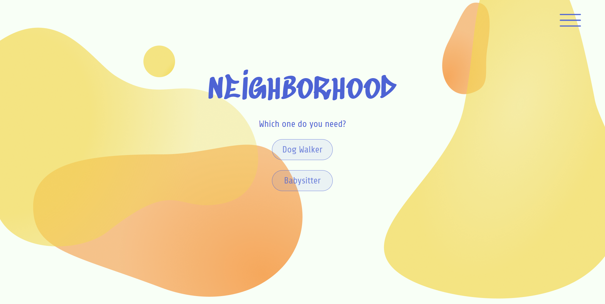
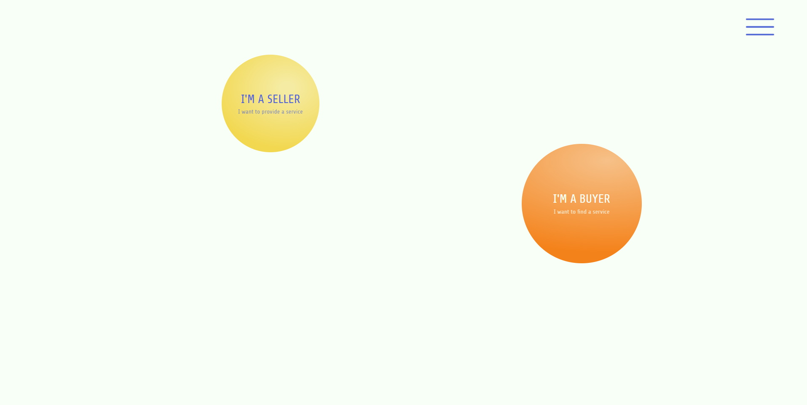
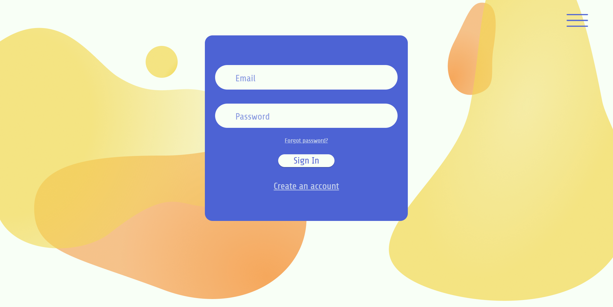
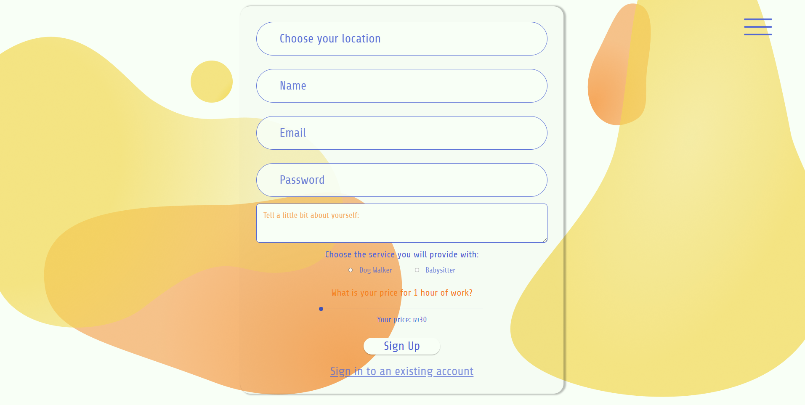
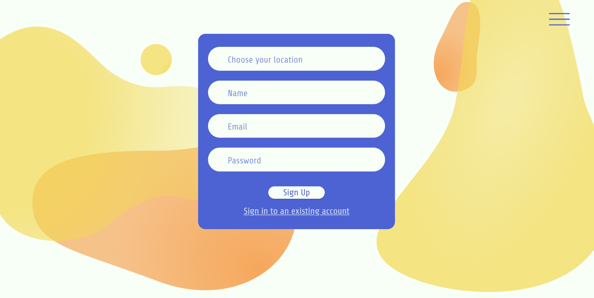
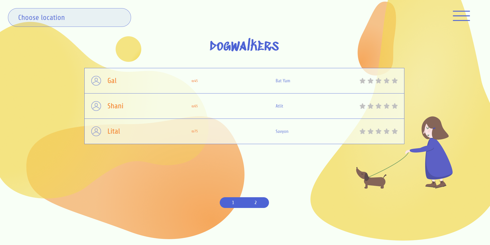

# Neighborhood App

This website was created as a Final Project at 'she codes;' (Israel).

Here is a link to the website: https://neighborhood-app-ce587.web.app/

The idea behind the project was to create a platform for people living in small localities and looking for different services providers (currently available babysitters and dogwalkers).

## Main features

Neighborhood implies two types of users: buyers and sellers. Buyers come to the platform in the purpose of finding the needed service, while sellers provide with those services.

There are opportunities to sign up, sign in and out for both types.

Also the list of providers depends on the location of the user who is currently signed in: if there is one, he/she will initially see all the providers of chosen type in his/her location. Otherwise the unsigned user will see all the providers (either dogwalkers or babysitters) in Israel.

## Tools used

React.js is the main tool for creating the Neighborhood project.
I also used firebase to be able to store and reuse users' data.

The UI/UX and drawings were created on Figma by me.

### Thank you for your attention!
I'm always glad to receive feedback! :)

